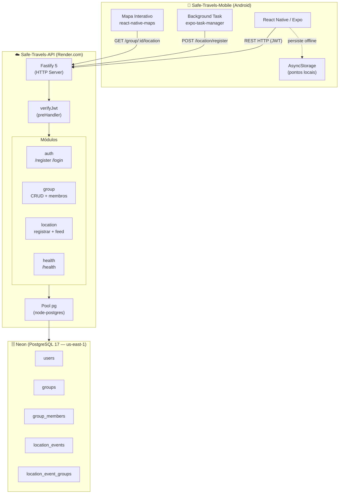

# Capítulo 1 — Visão Geral da Implementação

## 1.1 Contexto

O Safe Travels é um sistema colaborativo para compartilhamento de localização em tempo real durante viagens em grupo. O problema central que o sistema endereça é a dificuldade de manter membros de um grupo cientes da posição uns dos outros em situações com conectividade intermitente, sem depender de plataformas fechadas que centralizam dados de localização de forma opaca.

O trabalho é composto por três repositórios:

| Repositório           | Função                                    |
| --------------------- | ----------------------------------------- |
| `Safe-Travels-API`    | Backend REST em Node.js                   |
| `Safe-Travels-Mobile` | Aplicativo Android em React Native / Expo |
| `Safe-Travels-Wiki`   | Documentação e registro do TCC            |

---

## 1.2 Objetivo do sistema

O sistema permite que usuários:

1. Criem uma conta e autentiquem-se via JWT.
2. Formem grupos de viagem.
3. Compartilhem automaticamente sua localização GPS com os membros do grupo.
4. Visualizem em tempo real a posição dos demais membros num mapa interativo.

O compartilhamento ocorre tanto em primeiro plano (tela aberta) quanto em segundo plano (app minimizado), garantindo que o rastreamento persista durante o uso normal do dispositivo.

---

## 1.3 Mudança arquitetural: AWS → Render

### Plano original

O plano documentado no TCC I previa uma arquitetura serveless na AWS:

- **API Gateway + AWS Lambda (SAM)** — processamento de requisições HTTP
- **Amazon Kinesis Data Streams** — ingestão assíncrona de eventos de localização em alta frequência
- **Amazon RDS (PostgreSQL)** — armazenamento relacional

Essa abordagem foi desenhada para aproveitar o _free tier_ da AWS, que cobre até 750 horas/mês de execução de instâncias e 1 milhão de invocações Lambda gratuitas.

### Motivo da mudança

A conta AWS utilizada já havia esgotado o período de elegibilidade ao _free tier_ em uso anterior. Além disso, no período de desenvolvimento, a AWS alterou os termos e o formato do seu _free tier_, o que tornaria necessário um replanejamento completo da arquitetura antes mesmo de iniciar a implementação.

Dado o escopo e o prazo do TCC, optou-se por uma alternativa mais direta que permitisse focar no desenvolvimento das funcionalidades do sistema.

### Solução adotada

A API foi reimplementada como uma **aplicação Node.js convencional**, executando em contêiner Docker. O banco de dados passou a ser um PostgreSQL convencional, sem intermediários de streaming.

| Dimensão                | Plano original (AWS)              | Implementação atual                             |
| ----------------------- | --------------------------------- | ----------------------------------------------- |
| Execução da API         | Lambda (serverless)               | Node.js em Docker / Render                      |
| Ingestão de localização | Kinesis Data Streams (assíncrono) | INSERT direto no PostgreSQL (síncrono)          |
| Banco de dados          | RDS PostgreSQL                    | PostgreSQL 17 (Docker local / Neon em produção) |

Os arquivos `template.yaml`, `samconfig.toml` e `src/apiHandler.ts` permanecem no repositório como registro histórico da arquitetura anterior, mas não são utilizados nem evoluídos.

---

## 1.4 Diagrama de arquitetura geral

---

## 1.5 Stack tecnológico

### API

| Tecnologia              | Papel                          |
| ----------------------- | ------------------------------ |
| Node.js                 | Runtime                        |
| TypeScript              | Linguagem                      |
| Fastify                 | Framework HTTP                 |
| PostgreSQL              | Banco de dados                 |
| `pg` (node-postgres)    | Driver de banco                |
| `bcrypt`                | Hash de senhas                 |
| `jsonwebtoken`          | Emissão e verificação de JWT   |
| `zod`                   | Validação de entrada           |
| Docker / Docker Compose | Ambiente local                 |
| Render.com              | Hospedagem em produção         |
| Neon                    | PostgreSQL em produção (cloud) |

### Mobile

| Tecnologia          | Papel                         |
| ------------------- | ----------------------------- |
| React Native        | Framework mobile              |
| Expo                | Plataforma de build e runtime |
| TypeScript          | Linguagem                     |
| React Navigation    | Navegação entre telas         |
| `expo-location`     | Acesso ao GPS                 |
| `expo-task-manager` | Rastreamento em background    |
| `react-native-maps` | Mapa interativo (Google Maps) |
| AsyncStorage        | Persistência local de pontos  |
| EAS Build           | Build nativo e CI/CD          |
