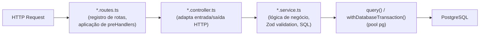

# Capítulo 2 — Arquitetura da API

## 2.1 Visão geral

A API do Safe Travels é uma aplicação HTTP REST escrita em TypeScript sobre Node.js 25, utilizando o framework Fastify 5. Ela expõe endpoints de autenticação, gerenciamento de grupos e localização, protegidos por autenticação com JWT.

---

## 2.2 Estrutura de módulos

A API é organizada em módulos independentes, cada um composto por três camadas:

```
src/
  server.ts                    # Entry point — monta e inicia o servidor Fastify
  config/
    environment.ts             # Leitura de variáveis de ambiente; exporta authConfig
    database.ts                # Pool pg; exporta query() e withDatabaseTransaction()
  middleware/
    jwt.ts                     # verifyJwt — preHandler para rotas protegidas
  types/
    fastify.d.ts               # Augmentação de FastifyRequest com request.user
  modules/
    health/                    # GET /health
    auth/                      # POST /auth/register, POST /auth/login
    user/                      # Stub — apenas health check
    trip/                      # Stub — apenas health check
    group/                     # CRUD de grupos e membros + localização do grupo
    location/                  # Registro e consulta de eventos de localização
```

Cada módulo segue o padrão:

```
<módulo>.routes.ts      # Registra as rotas no Fastify; aplica preHandlers
<módulo>.controller.ts  # Chama os services; adapta entrada/saída para HTTP
<módulo>.service.ts     # Lógica de negócio; queries SQL; validação com Zod
```

Essa separação mantém a lógica de negócio independente do framework HTTP, facilitando os testes unitários dos services sem precisar inicializar o servidor.

---

## 2.3 Dockerfile — build multi-stage

O Dockerfile utiliza três estágios para manter a imagem de produção enxuta:

```
deps    → npm ci (todas as dependências, incluindo devDependencies)
          usado pelo serviço seed no Docker Compose

build   → compila TypeScript (tsc) e remove devDependencies (npm prune --omit=dev)

runtime → imagem final — apenas dist/ e dependências de produção
          CMD: node dist/server.js
```

A imagem base em todos os estágios é `node:25-alpine`, que corresponde à mesma versão do Node.js utilizada em produção no Render.

---

## 2.4 Deploy em produção — Render

No ambiente de produção, a API roda como um serviço web no Render.com, sem Docker. O processo de build e start é configurado diretamente no `render.yaml`:

```
buildCommand:  npm ci && npm run build
startCommand:  node dist/server.js
healthCheckPath: /health
```

As variáveis sensíveis (credenciais do banco, JWT secret) são configuradas manualmente no painel do Render e nunca versionadas no repositório. As demais (host, porta, ambiente) estão declaradas no `render.yaml`.

O banco de dados em produção é o **Neon** — um PostgreSQL serverless hospedado na região `us-east-1`, acessado com SSL habilitado (`SAFE_TRAVELS_DB_SSL=true`).

---

## 2.5 Camadas por módulo



---

## 2.6 Padrões de código

- **ESM puro** — o projeto usa `"type": "module"` no `package.json`; imports usam extensão `.js` mesmo nos arquivos `.ts`, conforme convenção do TypeScript com ESM
- **Sem ORM** — todas as queries são SQL direto via `query()` do pool `pg`
- **Transações** — operações com múltiplas queries atômicas usam `withDatabaseTransaction()`
- **Validação com Zod** — entrada de dados validada na camada de service antes de qualquer acesso ao banco
- **Erros de domínio tipados** — `AuthError` e `GroupError` carregam `statusCode` e `message`; o controller os captura e devolve o HTTP status correto sem vazar stack traces

---

## 2.7 Módulo config/ — infraestrutura transversal

O diretório `config/` não é um módulo de domínio; é a camada de infraestrutura compartilhada por todos os módulos.

### database.ts

Centraliza a conexão com o PostgreSQL e expõe três funções públicas:

| Função | Uso |
|--------|-----|
| `query<T>(text, values)` | Executa uma query avulsa; retorna `QueryResult<T>` |
| `withDatabaseTransaction<T>(callback)` | Abre cliente dedicado, executa BEGIN/COMMIT/ROLLBACK automaticamente |
| `closeDatabase()` | Encerra o pool (usado em testes e graceful shutdown) |

O pool é configurado com no máximo 10 conexões simultâneas e timeout de 30 s para conexões ociosas. Em produção (Neon), SSL é habilitado via variável de ambiente `SAFE_TRAVELS_DB_SSL=true`.

```ts
// Uso de query avulsa
const result = await query<UserRow>(
  `SELECT user_id FROM users WHERE email = $1`,
  [email]
);

// Uso de transação (múltiplas queries atômicas)
return withDatabaseTransaction(async (client) => {
  await client.query(`INSERT INTO groups ...`, [...]);
  await client.query(`INSERT INTO group_members ...`, [...]);
});
```

### environment.ts

Lê as variáveis de ambiente com fallback para valores de desenvolvimento e exporta `authConfig`:

```ts
export const authConfig = {
  jwtSecret,       // SAFE_TRAVELS_AUTH_JWT_SECRET (default: "safe-travels-dev-secret")
  jwtExpiresIn,    // SAFE_TRAVELS_AUTH_JWT_EXPIRES_IN (default: "1h")
  bcryptSaltRounds // SAFE_TRAVELS_AUTH_BCRYPT_SALT_ROUNDS (default: 10)
} as const;
```

---

## 2.8 Middleware JWT

O arquivo `middleware/jwt.ts` exporta `verifyJwt`, utilizado como `preHandler` nas rotas protegidas.

**Fluxo:**
1. Extrai o header `Authorization: Bearer <token>`
2. Verifica e decodifica o token via `jwt.verify()`
3. Popula `request.user` com `{ userId, username, email }`
4. Retorna 401 se o token estiver ausente, inválido ou expirado

O tipo `AuthenticatedUser` exportado por este arquivo é o contrato usado pelos controllers para acessar o usuário autenticado sem precisar re-decodificar o token.

---

## 2.9 Módulos de domínio

### auth

Módulo responsável por registro, login e emissão de tokens JWT.

**Validação de entrada (Zod):**
- `registerSchema` — name (mín. 2), username (mín. 3, regex alfanumérico), email (formato), password (mín. 8)
- `loginSchema` — email e password

**Injeção de dependências:**  
O `auth.service.ts` aceita um objeto `AuthDependencies` opcional que permite substituir `databaseQuery`, `passwordHash`, `passwordCompare` e `signToken` por mocks nos testes unitários, sem precisar de uma base de dados real.

```ts
export async function registerUser(input: unknown, dependencies: AuthDependencies = {})
export async function loginUser(input: unknown, dependencies: AuthDependencies = {})
```

**Fluxo de registro:**
1. Valida input com Zod
2. Verifica se email ou username já existem (retorna 409 se sim)
3. Gera hash bcrypt da senha
4. Insere usuário no banco
5. Assina e retorna JWT com payload `{ sub: userId, username, email }`

**Fluxo de login:**
1. Valida input com Zod
2. Busca usuário por email
3. Compara senha com `bcrypt.compare()`
4. Retorna 401 genérico tanto para usuário não encontrado quanto para senha errada (evita enumeração de usuários)
5. Assina e retorna JWT

**Resposta de sessão:**
```json
{
  "accessToken": "eyJ...",
  "tokenType": "Bearer",
  "expiresIn": "1h",
  "user": { "id", "username", "name", "email", "createdAt", "updatedAt" }
}
```

---

### group

Módulo de gerenciamento de grupos de viagem.

**Regras de negócio:**
- Apenas o `owner` pode adicionar ou remover membros
- O `owner` não pode sair do próprio grupo — deve deletá-lo
- Qualquer membro pode sair (`DELETE /group/:id/members/:userId` com self-removal)
- Deleção é **soft delete** (`deleted_at = now()`)

**Operações atômicas com transação:**  
A criação de grupo executa três queries em uma única transação: `INSERT` na tabela `groups`, `INSERT` em `group_members` (owner já entra como membro) e `SELECT` para retornar os dados do owner.

**Funções utilitárias internas:**
- `mapGroup(row)` — converte snake_case do banco para camelCase da resposta
- `mapMember(row)` — idem para membros

---

### location

Módulo de registro e consulta de eventos de localização GPS.

**Validação de entrada:**  
A validação não usa Zod; é feita por `validateRegisterLocationInput()` com checagens manuais de tipo e range:
- `latitude` entre −90 e 90
- `longitude` entre −180 e 180
- `accuracyMeters` ≥ 0 (opcional)
- `capturedAt` ISO válido (opcional; default: `now()`)

Funções auxiliares exportadas separadamente:
- `validateLocationEventIdInput(id)` — garante inteiro positivo
- `validateUserIdInput(id)` — garante string não vazia

**Fluxo de registro (transacional):**
1. Valida o input
2. Insere em `location_events`
3. Busca todos os grupos do usuário em `group_members`
4. Se houver grupos, insere em `location_event_groups` usando `unnest($2::varchar[])` para batch insert em uma única query

**Consulta de última localização por usuário:**  
Usa `DISTINCT ON (le.user_id)` do PostgreSQL combinado com `ORDER BY le.user_id, le.captured_at DESC` para obter o evento mais recente de cada usuário em uma única passagem pela tabela, sem subquery.

**Função utilitária interna:**
- `mapLocationRow(row)` — converte snake_case do banco para camelCase

---

### user e trip (stubs)

Ambos os módulos existem apenas com a estrutura `routes/controller/service` mas sem lógica de negócio implementada — retornam apenas um health check. O esquema do banco já prevê a tabela `trips` e a tabela de junção `location_event_trips`, mas as foreign keys ainda não estão conectadas ao módulo.

---

### health

Retorna status da API. Endpoint usado pelo Render como `healthCheckPath` para verificar se o serviço está no ar.

---

## 2.10 Endpoints

| Método | Path | Auth | Módulo |
|--------|------|------|--------|
| GET | `/health` | — | health |
| POST | `/auth/register` | — | auth |
| POST | `/auth/login` | — | auth |
| POST | `/group` | JWT | group |
| GET | `/group/:groupId` | — | group |
| GET | `/group/user/:userId` | — | group |
| POST | `/group/:groupId/members` | JWT | group |
| DELETE | `/group/:groupId/members/:userId` | JWT | group |
| DELETE | `/group/:groupId` | JWT | group |
| GET | `/group/:groupId/location` | — | location |
| POST | `/location/register` | JWT | location |
| GET | `/location/id/:locationEventId` | — | location |
| GET | `/location/user/:userId` | — | location |
| GET | `/location/latest` | — | location |

---

## 2.11 Padrão de resposta HTTP

Todas as respostas seguem o mesmo envelope:

```json
{
  "status": "ok",
  "timestamp": "2025-06-01T12:00:00.000Z",
  "message": "Mensagem legível",
  "data": { }
}
```

Erros retornam o mesmo envelope com `"status": "error"` e sem campo `data`. Os HTTP status codes usados são:

| Código | Situação |
|--------|----------|
| 200 | Sucesso |
| 400 | Input inválido |
| 401 | Token ausente, inválido ou credenciais erradas |
| 403 | Ação não permitida para o usuário autenticado |
| 404 | Recurso não encontrado |
| 409 | Conflito (email ou username já em uso) |
| 500 | Erro interno inesperado |
