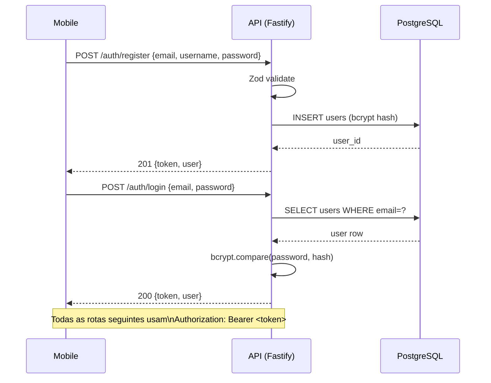

# Capítulo 4 — Autenticação

## 4.1 Visão geral

O módulo de autenticação é responsável pelo cadastro de usuários e pelo login. Após uma autenticação bem-sucedida, a API emite um **JSON Web Token (JWT)** que o cliente mobile armazena localmente e inclui em todas as requisições subsequentes às rotas protegidas.

O módulo implementa dois endpoints:

| Método | Rota             | Descrição                |
| ------ | ---------------- | ------------------------ |
| POST   | `/auth/register` | Cadastro de novo usuário |
| POST   | `/auth/login`    | Login por email e senha  |

---

## 4.2 Cadastro (`POST /auth/register`)

### Body da requisição

```json
{
  "name": "string",
  "username": "string",
  "email": "string",
  "password": "string"
}
```

### Resposta de sucesso (201)

```json
{
  "accessToken": "eyJ...",
  "tokenType": "Bearer",
  "expiresIn": "1h",
  "user": {
    "id": "uuid",
    "name": "Alice Silva",
    "username": "alice",
    "email": "alice@safetravels.dev"
  }
}
```

O cadastro já retorna um token JWT, evitando que o usuário precise fazer um segundo request de login após criar a conta.

---

## 4.3 Login (`POST /auth/login`)

### Body da requisição

```json
{
  "email": "string",
  "password": "string"
}
```

O Swagger original especificava login por `username`. A implementação usa `email` — decisão definitiva adotada durante o desenvolvimento.

Tanto usuário não encontrado quanto senha incorreta retornam `401` com mensagem genérica, sem indicar qual das duas condições falhou. Isso evita vazamento de informação sobre quais emails estão cadastrados.

---

## 4.4 JWT

### Payload

```json
{
  "sub": "uuid-do-usuario",
  "username": "alice",
  "email": "alice@safetravels.dev",
  "iat": 1714000000,
  "exp": 1714003600
}
```

| Campo      | Descrição                                                                  |
| ---------- | -------------------------------------------------------------------------- |
| `sub`      | ID do usuário (UUID) — campo padrão JWT para "subject"                     |
| `username` | Nome de usuário                                                            |
| `email`    | Email do usuário                                                           |
| `iat`      | Timestamp de emissão (gerado automaticamente pelo `jsonwebtoken`)          |
| `exp`      | Timestamp de expiração (controlado por `SAFE_TRAVELS_AUTH_JWT_EXPIRES_IN`) |

### Validade e renovação

Os tokens têm validade de 1 hora por padrão. O sistema é **stateless** — não há armazenamento de tokens no servidor nem mecanismo de refresh token. Tokens expirados exigem novo login.

---

## 4.5 Middleware `verifyJwt`

O middleware `src/middleware/jwt.ts` exporta a função `verifyJwt`, um preHandler Fastify aplicado a todas as rotas protegidas:

```
1. Lê o header Authorization: Bearer <token>
2. Extrai o token (remove o prefixo "Bearer ")
3. Verifica assinatura e validade com jwt.verify()
4. Popula request.user = { userId, username, email }
5. Retorna 401 se token ausente, inválido ou expirado
```

A augmentação de tipo `src/types/fastify.d.ts` declara `request.user` como `AuthenticatedUser | undefined`, garantindo que o TypeScript infira o tipo correto em handlers protegidos.

O preHandler é aplicado por rota, não globalmente. Rotas de health check e as rotas `/auth/register` e `/auth/login` são públicas.

---

## 4.6 Hash de senhas

O bcrypt é utilizado com 10 rounds de salt. Esse valor equilibra segurança e performance: rounds insuficientes facilitam ataques de força bruta; rounds excessivos adicionam latência perceptível ao login.

O número de rounds é configurável via `SAFE_TRAVELS_AUTH_BCRYPT_SALT_ROUNDS`, permitindo ajuste em produção sem alterar o código.

---

## 4.7 Diagrama de fluxo



---

## 4.8 Tratamento de erros

A camada de service define `AuthError`, uma classe que estende `Error` e carrega um `statusCode`. O controller captura instâncias de `AuthError` e devolve o código HTTP correspondente. Erros não antecipados são relançados pelo controller, sendo capturados pelo handler de erros do Fastify que retorna 500.
