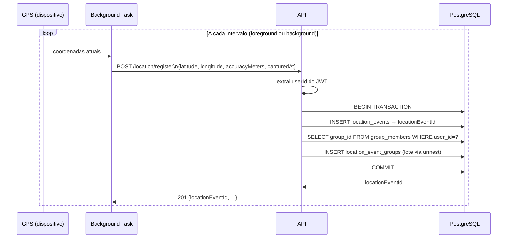

# Capítulo 6 — Módulo de Localização

## 6.1 Visão geral

O módulo de localização é o núcleo funcional do Safe Travels. Ele é responsável por receber, armazenar e servir eventos de posição GPS dos usuários. Uma decisão central de design é que cada evento de localização é **automaticamente vinculado a todos os grupos dos quais o usuário faz parte** no momento do registro — sem que o cliente precise gerenciar essa associação.

### Endpoints implementados

| Método | Rota                               | Descrição                                        |
| ------ | ---------------------------------- | ------------------------------------------------ |
| POST   | `/location/register`               | Registra posição do usuário autenticado          |
| GET    | `/location/latest`                 | Última posição de cada usuário                   |
| GET    | `/location/latest?userIds=id1,id2` | Filtra por lista de usuários                     |
| GET    | `/location/id/:locationEventId`    | Busca evento por ID                              |
| GET    | `/location/user/:userId`           | Última posição de um usuário específico          |
| GET    | `/group/:groupId/location`         | Última posição dos membros de um grupo (anônima) |

> `GET /group/:groupId/location` está definido no módulo de grupos mas sua lógica é executada pelo serviço de localização (`getGroupLatestLocations`).

---

## 6.2 Registro de localização (`POST /location/register`)

### Fluxo

O `userId` é extraído do JWT — o cliente não precisa (e não deve) enviar o ID do usuário no body. Isso garante que um usuário não possa registrar localização em nome de outro.

A vinculação a grupos ocorre dentro da mesma transação: se o `INSERT` no `location_events` falhar, nenhuma entrada em `location_event_groups` é criada. A inserção em lote usa `unnest($2::varchar[])`, evitando múltiplos round-trips ao banco.

### Body da requisição

```json
{
  "latitude": -30.0574,
  "longitude": -51.1778,
  "accuracyMeters": 12,
  "capturedAt": "2026-04-19T08:10:00.000Z"
}
```

| Campo            | Tipo     | Obrigatório | Validação                             |
| ---------------- | -------- | ----------- | ------------------------------------- |
| `latitude`       | number   | Sim         | entre -90 e 90                        |
| `longitude`      | number   | Sim         | entre -180 e 180                      |
| `accuracyMeters` | integer  | Não         | ≥ 0                                   |
| `capturedAt`     | ISO 8601 | Não         | data válida; padrão: `now()` no banco |

### Resposta (201)

```json
{
  "status": "ok",
  "data": {
    "locationEventId": 42,
    "userId": "uuid",
    "latitude": -30.0574,
    "longitude": -51.1778,
    "accuracyMeters": 12,
    "capturedAt": "2026-04-19T08:10:00Z",
    "createdAt": "2026-04-19T08:10:01Z"
  }
}
```

---

## 6.3 Feed de localização por usuário (`GET /location/latest`)

Retorna a **última posição registrada de cada usuário**. Sem parâmetros, retorna todos os usuários com ao menos um evento. Com `?userIds=id1,id2`, filtra para a lista especificada.

A query usa `DISTINCT ON (user_id) ... ORDER BY user_id, captured_at DESC`, aproveitando o índice `idx_location_events_user_id_captured_at` para eliminar a necessidade de subqueries ou agregações.

### Resposta

```json
{
  "status": "ok",
  "data": [
    {
      "locationEventId": 42,
      "user": {
        "userId": "uuid",
        "username": "alice",
        "name": "Alice Silva"
      },
      "latitude": -30.0574,
      "longitude": -51.1778,
      "accuracyMeters": 12,
      "capturedAt": "2026-04-19T08:10:00Z",
      "createdAt": "2026-04-19T08:10:01Z"
    }
  ]
}
```

---

## 6.4 Localização por evento e por usuário

### `GET /location/id/:locationEventId`

Busca um evento específico pelo seu ID inteiro. Retorna `404` se não encontrado.

### `GET /location/user/:userId`

Retorna o evento mais recente de um usuário específico, ordenado por `captured_at DESC LIMIT 1`. Retorna `404` se o usuário não possui eventos.

Ambos os endpoints retornam a mesma estrutura de resposta com dados do usuário (`userId`, `username`, `name`).

---

## 6.5 Localização por grupo (`GET /group/:groupId/location`)

### Anonimização da localização

A resposta desta rota **não inclui `userId`** nas entradas de localização — apenas coordenadas, precisão e timestamps. Isso implementa um nível básico de privacidade: membros do grupo visualizam onde outros membros estão no mapa sem receber identificadores explícitos de quem é cada ponto.

```json
{
  "status": "ok",
  "data": [
    {
      "locationEventId": 42,
      "latitude": -30.0574,
      "longitude": -51.1778,
      "accuracyMeters": 12,
      "capturedAt": "2026-04-19T08:10:00Z",
      "createdAt": "2026-04-19T08:10:01Z"
    }
  ]
}
```

A query usa `DISTINCT ON (le.user_id)` com `ORDER BY le.user_id, le.captured_at DESC` para garantir que apenas a posição mais recente de cada membro apareça na resposta, independentemente do volume de histórico armazenado.

---

## 6.6 Diagrama de fluxo de registro



---

## 6.7 Relação com o plano original

O plano original previa o **Amazon Kinesis Data Streams** como intermediário de ingestão de localização: o mobile enviaria eventos ao Kinesis, uma Lambda de processamento consumiria a fila e gravaria no banco de forma assíncrona. Essa arquitetura foi projetada para suportar alto volume de eventos com desacoplamento entre ingestão e armazenamento.

Com a remoção da AWS, toda a localização vai **diretamente ao PostgreSQL de forma síncrona**. Para o escopo do TCC — poucos usuários simultâneos em testes — esse modelo é equivalente em termos de funcionalidade e significativamente mais simples de operar.

A tabela `location_event_trips`, que seria alimentada pela Lambda de processamento de fila, foi criada no schema mas não possui FK para a tabela `trips` (ainda não implementada), aguardando o desenvolvimento futuro do módulo de viagens.
