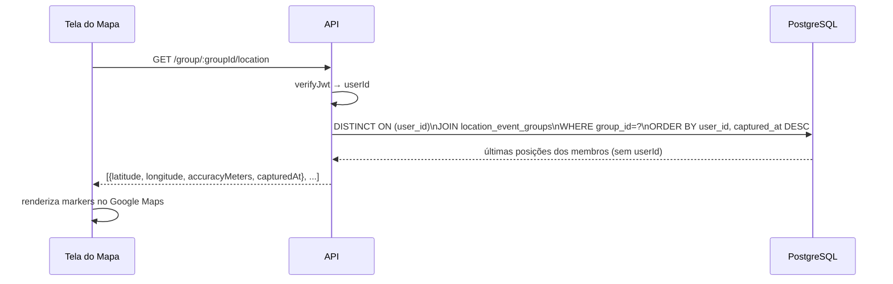

# Capítulo 9 — Tela do Mapa

## 9.1 Visão geral

A `MapScreen` é a tela central do Safe Travels. Ela exibe um mapa interativo com a posição do usuário atual e os pins de outros membros e grupos. Ao abrir a tela, o app captura a posição do dispositivo, registra na API e carrega as localizações dos demais usuários e grupos.

---

## 9.2 Mapa

O mapa é renderizado com `react-native-maps` usando `PROVIDER_GOOGLE` (Google Maps). O provider explícito é obrigatório no Android para que o `customMapStyle` funcione — sem ele, a propriedade é ignorada. Um estilo visual customizado é aplicado via `mapStyle.ts`, dando ao mapa uma identidade visual alinhada ao tema do aplicativo.

Opções habilitadas:

- `showsUserLocation` — exibe o ponto azul nativo do sistema para a localização do dispositivo
- `showsMyLocationButton` — botão para recentrar no usuário

---

## 9.3 Pins no mapa

### Pins de usuários (dourados)

- **Fonte:** `GET /location/latest` — retorna a última posição de cada usuário no sistema
- **Cor:** `#A99942` (`secondary_3` da paleta do app)
- **Título:** nome do usuário (`loc.user.name`)
- **Descrição:** `@username · horário da captura` (formatado em `pt-BR`)

### Pins de grupos (azuis)

- **Fonte:** `GET /group/:groupId/location` — retorna a última posição anônima dos membros de cada grupo
- **Cor:** `#4E3FCA` (`primary` da paleta do app)
- **Título:** nome do grupo
- **Descrição:** horário da captura (formatado em `pt-BR`)

Os pins de grupos são **anônimos** por design: a API não retorna o `userId` na resposta de localização por grupo. O usuário vê onde os membros estão, mas não qual pin pertence a quem.

---

## 9.4 Centralização no usuário logado

Após capturar a posição atual, o mapa anima para centralizar na coordenada do usuário logado com `mapRef.current.animateToRegion()`, usando delta de 0.01° (aproximadamente 1 km de raio visível). Isso garante que a tela abre sempre no contexto espacial relevante ao usuário.

---

## 9.5 Tratamento de erros e estados

| Situação                                 | Comportamento                                                      |
| ---------------------------------------- | ------------------------------------------------------------------ |
| Permissão de localização negada          | Exibe mensagem de erro no lugar do mapa                            |
| Posição ainda sendo capturada            | Exibe `ActivityIndicator` centralizado                             |
| Falha ao registrar localização na API    | Ignorado (fire-and-forget — não bloqueia o carregamento)           |
| Falha ao buscar localizações de usuários | Loga erro; retorna array vazio (mapa carrega sem pins de usuários) |
| Falha ao buscar localização de um grupo  | Loga erro; retorna array vazio para aquele grupo                   |

O carregamento é resiliente: falhas em chamadas individuais não impedem a tela de carregar. A prioridade é exibir o mapa com o máximo de informação disponível.

---

## 9.6 Registro de localização ao abrir o mapa

Ao abrir a tela, o app registra a posição atual na API (best-effort, sem aguardar resposta). Essa chamada serve para:

1. Garantir que a posição do usuário apareça para os demais membros do grupo ao carregar o mapa
2. Vincular o evento de localização aos grupos do usuário via `location_event_groups`

**Pendência conhecida:** o background tracking também pode registrar uma posição no mesmo momento que a `MapScreen` abre, resultando em dois eventos com `captured_at` idêntico ou muito próximo. A solução prevista é remover o `registerLocation` da `MapScreen` e delegar todo o envio ao background tracking.

---

## 9.7 Diagrama de fluxo de carregamento



---

## 9.8 Considerações de produção

Para builds de produção que utilizem o Google Maps, é necessário configurar a chave de API no `app.json`:

```json
"android": {
  "config": {
    "googleMaps": {
      "apiKey": "GOOGLE_MAPS_API_KEY"
    }
  }
}
```

Sem a chave, o mapa pode não carregar ou exibir um watermark de "For development purposes only".
